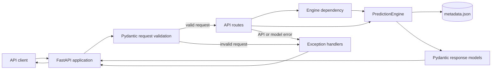

# Production Prediction Service

A small FastAPI service that exposes a metadata-driven customer churn prediction API for customers associated with the banking industry. The current predictor uses a logistic function and coefficients stored in `src/engine/metadata.json`; it is intentionally structured so the calculation engine can later be replaced by a trained model without changing the external API contract.

## Architecture



The same diagram is available on its own in [docs/architecture.md](docs/architecture.md).

At runtime, the request flow is:

1. FastAPI receives an HTTP request.
2. Pydantic validates the top-level `PredictionRequest` fields.
3. The route obtains a `PredictionEngine` through the `get_engine` dependency.
4. The engine loads and validates the local model metadata.
5. The route verifies that every configured feature is present.
6. The engine calculates log odds, converts them to a probability, assigns a risk category, and records calculation time.
7. The route wraps the result in a `PredictionResponse`.

## Problem

Prediction consumer applications often need a stable service boundary around a model. They should not need to know how a model is loaded, which coefficients it uses, or how a raw score becomes a customer-facing risk category.

This service addresses that boundary for a churn-style prediction workflow:

- Accept customer identity and feature data through a JSON API.
- Validate required request information before prediction.
- Detect missing model features with a clear client error.
- Keep model metadata and coefficients outside the Python calculation code.
- Return a stable response containing the prediction, model identity, and processing time.
- Expose health and model metadata endpoints for operational checks.

The current implementation is a deterministic reference service. It is suitable for local development, API contract work, and model-serving experiments; it is not yet a production deployment of a trained ML artifact.

## Design

### Repository layout

```text
src/
	engine/
		metadata.json       Model identity, feature definitions, and weights
		predict.py          PredictionEngine and scoring logic
	schemas/
		requests.py         Incoming request models
		responses.py        HTTP response models
		models.py           Internal model metadata and prediction models
		exceptions.py       Domain and API exceptions
	service/
		main.py             FastAPI application and exception handlers
		api/
			dependencies.py   PredictionEngine dependency factory
			routes.py         /health, /model, and /predict routes
tests/
	unit/                 Engine, schema, and dependency tests
	integration/          HTTP API behavior tests
docs/
	architecture.md      Standalone Mermaid architecture diagram
```

### Prediction calculation

The engine starts with the metadata intercept and adds each feature multiplied by its configured weight:

$$
z = b + \sum_{i=1}^{n} w_i x_i
$$

It then applies the logistic function and rounds the result to two decimal places:

$$
P(\text{churn}) = \frac{1}{1 + e^{-z}}
$$

The category thresholds are:

| Probability | Category |
| --- | --- |
| `< 0.33` | `LOW_RISK` |
| `0.33` to `< 0.67` | `MEDIUM_RISK` |
| `>= 0.67` | `HIGH_RISK` |

### Separation of concerns

- `PredictionEngine` owns metadata loading and prediction math.
- Route handlers own HTTP request and response composition.
- Pydantic models define the public data shape.
- Exception handlers translate known failures into HTTP responses.
- The metadata file keeps model identity, feature documentation, and weights configurable without changing scoring code.

## API

The application listens on port `8000` when started with the command shown in the Configuration section. FastAPI also exposes interactive documentation at `/docs` and `/redoc`.

### `GET /health`

Returns service availability and the API version.

```json
{
	"status": "healthy",
	"api_version": "1.0.0"
}
```

Response code: `200 OK`.

### `GET /model`

Returns the public identity of the loaded model, without exposing feature weights.

```json
{
	"model_name": "mock-churn-predictor",
	"model_version": "v1.0",
	"num_features": 8,
	"model_type": "logistic_regression"
}
```

Response codes:

- `200 OK` when metadata loads successfully.
- `500 Internal Server Error` when model initialization fails.

### `POST /predict`

Request body:

```json
{
	"request_id": "request-123",
	"customer_id": "customer-123",
	"features": {
		"credit_score": 650,
		"age": 45,
		"tenure": 3,
		"balance": 20000.0,
		"num_of_products": 1,
		"has_cr_card": 1,
		"is_active_member": 0,
		"estimated_salary": 50000.0
	}
}
```

Required feature keys are:

`credit_score`, `age`, `tenure`, `balance`, `num_of_products`, `has_cr_card`, `is_active_member`, and `estimated_salary`.

Successful response:

```json
{
	"response_id": "generated-uuid",
	"request_id": "request-123",
	"prediction": {
		"churn_probability": 0.7,
		"prediction": "HIGH_RISK"
	},
	"model": {
		"name": "mock-churn-predictor",
		"version": "v1.0"
	},
	"metadata": {
		"processing_time_ms": 0.01
	}
}
```

Response codes:

| Code | Meaning |
| --- | --- |
| `200` | Prediction created successfully |
| `422` | Missing or invalid top-level request information |
| `422` | Missing required feature, for example `Missing required features: age` |
| `500` | Unexpected prediction or model failure |

Example request with `curl`:

```powershell
curl.exe -X POST http://127.0.0.1:8000/predict `
	-H "Content-Type: application/json" `
	-d '{"request_id":"request-123","customer_id":"customer-123","features":{"credit_score":650,"age":45,"tenure":3,"balance":20000.0,"num_of_products":1,"has_cr_card":1,"is_active_member":0,"estimated_salary":50000.0}}'
```

## Configuration

### Prerequisites

- Python `3.10` or newer.
- `uv` installed and available on `PATH`.

### Install dependencies

From the repository root:

```powershell
uv sync --extra dev
```

The project dependencies are declared in `pyproject.toml`. `uv.lock` pins the resolved dependency graph.

### Start the service

```powershell
uv run uvicorn src.service.main:app --reload
```

For a non-reloading local process:

```powershell
uv run uvicorn src.service.main:app --host 0.0.0.0 --port 8000
```

### Model metadata

The engine reads `src/engine/metadata.json` at initialization. The file must contain these top-level fields:

- `model_name`
- `model_version`
- `num_features`
- `model_type`
- `features`
- `weights`

The `weights` object contains `intercept` and the coefficients used by the engine. The `features` object documents the expected feature keys and is also used by the API route to detect missing inputs.

There are currently no environment-variable settings or external service dependencies. Changing metadata requires restarting the process because the engine loads it during dependency creation.

## Testing

Install development dependencies and run the complete suite:

```powershell
uv sync --extra dev
uv run pytest -q
```

Run only unit tests:

```powershell
uv run pytest tests/unit -q
```

Run only integration tests:

```powershell
uv run pytest tests/integration -q
```

Show `print()` output from tests:

```powershell
uv run pytest tests/integration -s -q
```

The test suite covers:

- Metadata loading and invalid metadata.
- Log-odds and probability calculations.
- All three risk categories.
- Missing feature detection.
- Request and response schema requirements.
- Dependency error translation.
- Health, model, and prediction endpoints.
- HTTP `404`, `422`, and `500` behavior.

## Failure Handling

Known failures are translated at the HTTP boundary:

| Failure | Handler | Status | Response |
| --- | --- | --- | --- |
| Missing top-level request field | FastAPI `RequestValidationError` handler | `422` | `Missing required information in payload: customer_id` |
| Missing feature | `InvalidRequest` handler | `422` | `Missing required features: age` |
| Invalid model initialization | `ModelInitializationError` handler | `500` | `Failed to initialize the prediction engine` |
| Unexpected route failure | `UnknownAPIException` handler | `500` | `An unexpected error occurred` |
| Unknown route | FastAPI default handler | `404` | `Not Found` |

The service deliberately avoids returning model internals in generic `500` responses. Detailed exception context remains available in the server process for logging, but the current application does not yet configure structured logging or centralized error reporting.

One important operational distinction is that Pydantic request validation happens before the route function runs. Missing `customer_id` therefore uses the `RequestValidationError` handler, while a missing key inside the free-form `features` dictionary is detected by the prediction route.

## Performance

The engine measures only the scoring section with `time.perf_counter()` and returns the elapsed duration as `metadata.processing_time_ms`. This value does not include all network, JSON parsing, dependency, metadata-loading, or response-serialization time.

The current scoring operation is $O(n)$ in the number of configured features and uses constant-size in-memory metadata after initialization. The arithmetic itself is lightweight; in a deployed service, the dominant latency is more likely to come from process startup, dependency construction, request handling, network overhead, logging, or a future model runtime.

Performance work should measure the complete request lifecycle, not only the engine timer. At minimum, collect request count, success and error counts, latency percentiles such as p50, p95, and p99, and resource utilization. Measurements should be separated by endpoint and status code, and should include realistic payload sizes and concurrency.

## Incident Analysis

The following incidents were identified and resolved during development:

### Import failures during test execution

Running the test file directly caused `ImportError: attempted relative import with no known parent package`. Switching tests to absolute `src` imports and ensuring the repository root is available on `sys.path` resolved the package-context problem.

Running under a system interpreter then caused `ModuleNotFoundError: No module named 'src'` or missing dependencies depending on the working directory. The supported invocation is from the repository root with `uv run`, and `tests/conftest.py` provides test discovery path setup.

### Pydantic model passed as JSON

Passing a `PredictionRequest` object directly as the HTTP client's `json` value caused a serialization error. Tests now send `request.model_dump()` so the client receives a plain dictionary.

### Missing prediction timing field

`ModelPrediction` requires `processing_time_ms`. The engine now measures its calculation and supplies that field before the response is built.

### Inconsistent client error messages

Top-level missing fields and missing nested features follow different validation paths. Explicit handlers and route checks now provide distinct, stable messages so clients can tell whether request information or a model feature is missing.

For future incidents, capture the request correlation identifier (`request_id`), endpoint, response code, latency, exception class, model version, and deployment version. Do not log sensitive customer data or full feature payloads by default.

## Design Decisions

- **FastAPI:** Provides typed request parsing, dependency injection, OpenAPI documentation, and a lightweight HTTP layer.
- **Pydantic models:** Make required top-level fields explicit and produce consistent validation behavior.
- **JSON metadata:** Keeps the example model inspectable and easy to replace while avoiding a database or model registry dependency.
- **Dependency-created engine:** Keeps route signatures testable and allows dependency overrides in integration tests. A production deployment should consider caching a validated engine rather than rebuilding it per request.
- **Stable response envelope:** Separates prediction values, model identity, and timing metadata so consumers can evolve independently.
- **Custom exception handlers:** Prevent implementation details from leaking into client responses and provide predictable status codes.
- **Separate unit and integration tests:** Unit tests isolate model behavior; integration tests verify the complete HTTP contract.
- **`uv` workflow:** Provides reproducible dependency resolution and a single command for running the service and tests.

## Limitations

- The current predictor is a hand-configured reference calculation, not a trained or persisted ML model.
- Feature values are stored in a plain `dict`, so the API does not enforce per-feature types, ranges, units, or domain constraints.
- The engine has a hard-coded required-feature list that can drift from the feature definitions in metadata.
- Model metadata is loaded from the local filesystem and is not versioned or fetched from a model registry at runtime.
- The dependency creates a new engine and reads metadata for each request that uses it; this adds avoidable overhead.
- There is no authentication, authorization, rate limiting, request size policy, or abuse protection.
- There is no persistence, batch prediction endpoint, asynchronous job workflow, or request queue.
- There is no structured logging, metrics exporter, tracing, alerting, or health distinction between process health and model readiness.
- Processing time measures only the arithmetic block, so it should not be treated as end-to-end latency.
- Error handling returns generic `500` responses for unexpected failures and does not yet expose a machine-readable error code.
- The current test suite does not include load tests, contract tests against deployed infrastructure, security tests, or model-quality evaluation.

## Future Improvements

### Model serving

- Plug in an actual trained ML model with a defined serialization format and compatibility contract.
- Load models through a model registry or artifact store with checksums, staged rollouts, and rollback support.
- Validate model and feature schema compatibility at startup.
- Add model-quality metrics such as precision, recall, ROC-AUC, calibration, drift, and segment-level performance.

### Throughput and latency

- Cache a validated engine and metadata rather than constructing it for every request.
- Benchmark request bottlenecks across parsing, dependency creation, model inference, serialization, and network layers.
- Add load and stress tests with realistic concurrency and payload distributions.
- Measure and publish p50, p95, p99, maximum latency, throughput, error rate, and saturation signals.
- Profile CPU and memory use, then tune worker counts, connection limits, payload handling, and model execution.
- Batch compatible requests where the selected model benefits from vectorized inference.

### Asynchronous and batch workflows

- Enable asynchronous request handling where model and downstream I/O make it beneficial.
- Add a queue-backed asynchronous prediction endpoint for long-running inference.
- Return a job identifier and provide status and result endpoints.
- Support batch prediction with bounded payload sizes and partial-failure reporting.

### Reliability and operations

- Add structured logs, distributed tracing, Prometheus-compatible metrics, and alerts.
- Separate liveness, readiness, and model-readiness checks.
- Add graceful shutdown, timeouts, retries where appropriate, and concurrency limits.
- Add authentication, authorization, rate limiting, redaction, and audit logging.
- Introduce canary deployment, model rollback, and configuration validation in CI/CD.

### Maintainability

- Generate feature validation models from the metadata schema or define one authoritative schema.
- Replace generic dictionaries with typed feature and response models.
- Add an explicit API error schema with stable error codes and request identifiers.
- Add OpenAPI contract checks and deployment smoke tests.