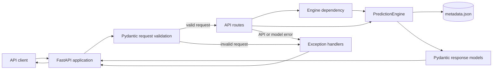

# Architecture

```mermaid
flowchart LR
    Client[API client]
    App[FastAPI application]
    Validation[Pydantic request validation]
    Routes[API routes]
    Dependency[Engine dependency]
    Engine[PredictionEngine]
    Metadata[(metadata.json)]
    Response[Pydantic response models]
    Error[Exception handlers]

    Client --> App
    App --> Validation
    Validation -->|valid request| Routes
    Validation -->|invalid request| Error
    Routes --> Dependency
    Dependency --> Engine
    Engine --> Metadata
    Routes --> Engine
    Engine --> Response
    Response --> App
    Routes -->|API or model error| Error
    Error --> App
    App --> Client
```